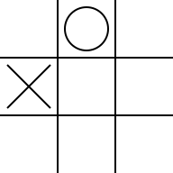
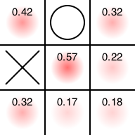
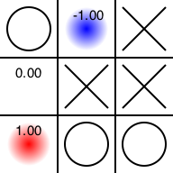

三目並べ全探索コード
===

三目並べを「お互いに完全にランダムな手を打つと仮定した時、先手がどこに打つとどれだけ有利か」を可視化するスクリプトです。

# 使い方

マスの状態を9文字の文字列で指定します。それぞれ「空白:0、先手:1、後手:2」です。

ただ状態を指定するとそのまま表示します。

    $ ruby ttt.rb 010200000
    Input state
    
     |o| 
    x| | 
     | | 

`-o FILENAME`で、状態をファイルに出力します。

    $ ruby ttt.rb 010200000 -o fig1.png
    Input state
    
     |o| 
    x| | 
     | | 
    Save to fig1.png

`-s`オプションをつけると確率を出力します。

    $ ruby ttt.rb 010200000 -s
    Input state

    |o| 
    x| | 
    | | 

    Probability

    +0.42|+0.00|+0.32
    +0.00|+0.57|+0.22
    +0.32|+0.17|+0.18

同時にファイル出力すると、画像ファイルに確率情報が出力されます。

    $ ruby ttt.rb 010200000 -s -o fig2.png
    Input state

    |o| 
    x| | 
    | | 

    Probability

    +0.42|+0.00|+0.32
    +0.00|+0.57|+0.22
    +0.32|+0.17|+0.18

    Save to fig2.png

先手有利の思われるところ(そこに打つと勝率が高い)が赤く表示されています。

逆に、そこに置いたら不利になる場所は青く表示されます。

    $ ruby ttt.rb 102022011 -s -o fig3.png
    Input state

    o| |x
    |x|x
    |o|o

    Probability

    +0.00|-1.00|+0.00
    +0.00|+0.00|+0.00
    +1.00|+0.00|+0.00

    Save to fig3.png

# ライセンス

MIT
