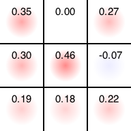

# 三目並べでモンテカルロ木探索

## はじめに

前回、[三目並べの評価関数を特異値分解](https://qiita.com/kaityo256/items/5a90830a83e8c1a188e3)してみました。この評価関数は、[三目並べの全探索](https://qiita.com/kaityo256/items/dfc93258692b38da64bf)をやって得たものですが、「すべての手の重みを同じと仮定している」、つまり「先手も後手も完全にランダムな手を打つ」と仮定して得られた評価関数です。今回はもうちょっと真面目に、モンテカルロ木探索(Monte Carlo Tree Search, MCTS)をやって評価関数を作ってみましょう。

コードはここに置いてあります。

https://github.com/kaityo256/tictactoe

## モンテカルロ木探索

囲碁や将棋などのAIの話で、よく「モンテカルロ木探索」という言葉が出てきます。ゲームの「手」を読んでいくと木構造になりますが、その木構造をモンテカルロ探索により調べ、有望な手を探そう、という戦略です。そう言われて「そんなもんか」と思うところまでは簡単ですが、いざ実装してみようとすると意外に「どうして良いかわからない」状態になります。少なくとも僕はそうなりました。というわけで、以下では三目並べにおいて、モンテカルロ木探索の手法の一つ、UCT(UCB1 applied to trees)を実装してみましょう。

まず、モンテカルロ木探索というのは、現在の局面において打てる手の「良さ」を調べるための手法です。しかし、囲碁や将棋、三目並べにおいて、「良さ」がわかるのは現在の局面よりずっと後、勝負がついてからです。そこで、「プレイアウト」という方法で現在の局面におけるその手の「良さ」を推定します。具体的にはあるポリシーに従って、そこから勝負がつくまで最後までゲームを進めてしまいます。その結果、勝った数と負けた数を調べ、その割合によってその手の「良さ」を推定しましょう、という方法です。

最も単純には、「いまある場所に置いたとして、その後何度もランダムにゲームを進めてみた場合の勝率を、その場所の良さだと思いましょう」という戦略が考えられます。それが以前の記事の「先手も後手も完全にランダムな手を打つ」と仮定して得られた評価関数となります。三目並べの初期局面における、ランダム戦略の評価関数はこんな感じになります。


例えば真ん中の評価値は0.5ですが、「先手、後手が全くランダムにプレイする場合、先手の勝利を1、敗北を-1、引き分けを0として、初手で真ん中に置くとその場合の期待値は0.5」ということです。評価値が全て正なので先手有利、かつ評価が真ん中＞角＞それ以外の順番になっており、これは直感にあっています。

しかし、我々は「三目並べはお互いに最善手を指せば必ず引き分ける」ということを知っています。先程のランダム戦略はちょっと評価としては粗すぎるようなので、もう少しちゃんとした戦略で探索し、先手、後手ともに最善手を志向するような評価関数の構築を目指しましょう。そのような方法の一つとしてここではUCTを実装します。UCTとはUCB1(Upper Confidence Bound)法をモンテカルロ木探索に応用したものです。UCB1とは

* 現在の状態で、まだ選んでいない「手」があれば選ぶ。(選んでない「手」が複数ある場合はランダムに選ぶ)
* すべて一度は選んだことがある手であれば、その中で「その手を選んだ場合のこれまでの期待値と半値幅の和が最大の手を選ぶ」

という戦略です。UCB1については[簡単な記事](https://qiita.com/kaityo256/items/b2c2d009d1e272fafd36)を書いたのでそちらも参照してください。

## UCTの実装

さて、UCTを実装します。UCTを実装するために必要な情報は

* 現在の局面における合法手のリスト
* それぞれの手を何度試したか(プレイアウトの回数)
* 試した結果得られた総報酬

です。三目並べにおいては、対称性を使えばそうとう局面を落とせますが、ここでは手抜きして対称性は使わないことにしましょう。しかし、「手の順序」による違いは区別しないことにしましょう。

例えば以下のような局面を考えてみましょう。


三手進んだ局面ですが、いくら手抜きするとはいえ、初手を真ん中に置いたか、端に置いたかを区別するのはさすがにアホな気がします。そこで、ハッシュを使ってこの状態を保存します。先手を「1」後手を「2」、空白を「0」とすると、状態は9文字で表すことができます。この場合なら`210010000`です。これをハッシュキーとして状態を保存しましょう。

ハッシュに保存するのは`TState`クラスのインスタンスにしましょう。UCB1を実装したいので、戦術の通り最低限以下の情報は保存しておく必要があります。

* `@pos` 現在の局面における合法手のリスト
* `@num` それぞれの手を何度試したか(プレイアウトの回数)
* `@award` その手を試した結果得られた総報酬

というわけでコンストラクタはこうなります。

```rb
class TState
  def initialize(arr)
    # 現在の状態
    @arr = arr
    # おける場所
    @pos = arr.find_all_index(&:zero?)
    # その場所に何度置いたか
    @num = Array.new(@pos.size) { 0 }
    # これまでの総報酬
    @award = Array.new(@pos.size) { 0.0 }
  end
end
```

`Array.find_all_index`は、`Array`のうち、ある条件を満たすインデックスの配列を返します。

```rb
class Array
  def find_all_index
    a = []
    each_with_index do |v, i|
      a << i if yield v
    end
    a
  end
end
```

いちいちその場で作るとすぐRubocopが「メソッドが複雑すぎる」と怒られるので、Arrayにメソッドを追加しました。

さて、現在の状態が配列で与えられるときに、その状態をキーとして`TState`のインスタンスを探します。なければ作ります。そして、次の手を`TState.select`で返すようにしましょう。実装はこんな感じになるでしょう。

```rb
  def select(player)
    t = @num.find_all_index(&:zero?)
    if t.size.zero?
      # すべて選んだことがあれば、UCBが最大のものを選ぶ
      @pos[ucb_select(player)]
    else
      # もしまだ選んでいない場所があれば、その場所をランダムに選ぶ
      @pos[t.sample]
    end
  end
```

`ucb_select`は後で実装します。`player`は先手か後手かの区別です。

`TState.select`が選んだ手を最後まで進めた結果、得られた報酬を`TState`に教えてやる必要があります。これは

* その手を選んだ回数の増加
* 得られた報酬の追加

をすればよいので、こんな感じになるでしょうか。

```rb
  def add(index, value)
    i = @pos.index(index)
    @num[i] += 1
    @award[i] += value
  end
```

そのまんまですね。

さて、いよいよUCB1を実装しましょう。やるべきことは簡単で、

* 合法手それぞれの「これまでの報酬の期待値」と「報酬分布の半値幅」を計算し
* その合計がもっとも高いもの選ぶ

だけです。報酬の期待値は、`@award`の各要素を`@num`の対応する各要素で割るだけです。`zip`するだけですが、Rubocopがうるさいので、これも`Array`にメソッドを追加しておきましょう。

```rb
class Array
  def div(arr)
    zip(arr).map { |x, y| x.to_f / y }
  end
end
```

報酬分布の半値幅は、

* その局面に到達した数を$N$
* その局面において、ある手$i$を選択した回数を$n_i$

として、

$$
\sqrt{\frac{\ln N}{n_i}}
$$

で与えられます。正確にはさらにexploration parameterという比例係数が付きますが、ここでは1にしてしまいましょう。

これだけわかっていればUCB1で次に打つ手を探すのは簡単です。

```rb
  # 期待値と回数配列からUCBの配列を作成する
  def ucb_array(ave, num)
    total = num.sum.to_f
    r = Array.new(num.size) do |j|
      u = Math.sqrt(2.0 * Math.log(total) / num[j])
      ave[j] + u
    end
    r
  end

  # UCBに従って場所を選ぶ
  def ucb_select(player)
    mu = @award.div(@num)
    mu.map!(&:-@) if player == TTT::TAC
    r = ucb_array(mu, @num)
    r.max_index
  end
```

ただし、現在、先手が勝つと1、後手が勝つと-1という定義にしているため、現在の手番が先手であるか後手であるかにより、評価関数の符号を変える必要があります。それを

```rb
mu.map!(&:-@) if player == TTT::TAC
```

で表現しています。

`TState`が実装できてしまえば、MCTを実装するのは簡単です。やることはこれだけです。

* 現在の局面を調べ、勝負がついていれば報酬をreturn
* 現在の局面からハッシュをひいて`TState`のインスタンスを得る
* `TState.select`で次の手を得る
* 最後までプレイアウトした結果を`TState.add`で教える

先手をTIC、後手をTACと呼ぶことにして、状態を配列`arr`で渡すことにすると、探索コードはこれだけです。

```rb
    # TICの手番
    def search_tic(arr)
      return -1 if TTTWinCheck.win(arr, TTT::TAC)
      s = get_state(arr)
      i = s.select(TTT::TIC)
      b = arr.deep_dup
      b[i] = TTT::TIC
      v = search_tac(b)
      s.add(i, v)
      v
    end

    # TACの手番
    def search_tac(arr)
      return 1 if TTTWinCheck.win(arr, TTT::TIC) # TIC勝利
      return 0 if arr.count(0).zero? # 引き分け
      s = get_state(arr)
      i = s.select(TTT::TAC)
      b = arr.deep_dup
      b[i] = TTT::TAC
      v = search_tic(b)
      s.add(i, v)
      v
    end
```

TICとTACでほぼ同じコードなのでif文でまとめようか迷ったのですが、メソッド全体に渡るようなif文があるとすぐにRubocopが怒りはるので分けました。現在の状態から`TState`のインスタンスを得るのはこれだけです。

```rb
    def get_state(arr)
      key = arr.join("")
      @shash[key] = TState.new(arr) unless @shash.key?(key)
      @shash[key]
    end
```

以上で三目並べでUCTをする準備は整いました。

## UCTの実行結果

さて、UCTを実装できたことだし、その動作を見てみましょう。最初は、三目並べについて全く知識がありません。したがって、初期局面を与えられた時、すべての手を一度ずつ選び、最後までプレイアウトするしかありません。そしてこんな結果が得られました。


これは、例えば初手で左上を選び、その後に「先手、後手ともに完全にランダムに手を選んだ」場合、先手が勝った、ということを表します。同様に真ん中を選んだら先手が負けてしまいました。ここまで9回の試行をして、「初期局面において未知の手」がなくなりました。

初期局面では未知の手がなくなったので、次からは「これまでの知識において、期待値と半値幅の和が最大の手」を選び始めます。例えば一度勝った(ので有力と思われる)中段右を再度探索してみましょう。しかし、二手目はまだ探索しつくしていないため、必ずこれまでに指したことが無い手を選びます。そして、決着がつくまでプレイし、その結果得られた報酬をいま選んだ局面に追加します。例えば今回は負けたとするならば、先程の勝利による+1と、今回の敗北による-1で、中段右の「現時点における推定評価」は0になります。


こうして、「あまり探索しておらず、有望そうなところ」を重点的に調べ、その結果得られた知識を更新していくことで、「現局面でどの手がどれだけ良いか」の評価関数を作っていくことになります。

例えば初期局面において1000回プレイアウトした結果得られた評価関数はこんな感じになります。

    $ ruby uct.rb 000000000 -o test.png -i 1000
    Input state

    | | 
    | | 
    | | 

    Probability

    +0.35|+0.00|+0.27
    +0.30|+0.46|-0.07
    +0.19|+0.18|+0.22

    Save to test.png



この段階ではまだ先手、後手ともに十分な知見がないため、評価がランダム探索と同様に真ん中＞角＞その他の順番になっています。

しかし、10000回くらい試すと、後手が十分に賢くなって「必敗の手」を避けるようになります。その結果、初期局面においてはほぼ引き分けることがわかって来ます。

    $ ruby uct.rb 000000000 -o test.png -i 10000
    Input state

    | | 
    | | 
    | | 

    Probability

    +0.13|+0.03|+0.11
    +0.07|+0.21|-0.06
    +0.09|+0.09|+0.08

    Save to test.png


まだやや真ん中が有利と判断していますが、試行回数を増やせばすべて評価値ゼロ(=引き分け)に収束していきます。

逆に、必勝の手がある場合には、そこだけを選ぶようになります。よく知られているように、三目並べにおいて先手が真ん中に置いた場合、後手が角に置かなければ先手必勝です。

したがって、先手が真ん中においた状態を調べさせた場合、後手は角を取るように学習すると考えられます。それを見てみましょう。

    $ ruby uct.rb 000010000 -o test.png -i 10000
    Input state

    | | 
    |o| 
    | | 

    Probability

    +0.47|+0.54|+0.40
    +0.62|+0.00|+0.58
    +0.07|+0.65|+0.43

    Save to test.png


この評価関数は「先手の有利度」を表しているため、後手はそれを下げようとします。その結果、左下の角に置くと引き分けの目があることを発見し、そこを集中的に探しています。対称性から別の角でも良いのですが、それらはそうそうに見限ったようです。

逆に、先手が中央、後手が角以外に置いた場合は、「後手が置いた場所の反対側以外」におけば先手必勝です。

    $ ruby uct.rb 020010000 -o test.png -i 10000 
    Input state

    |x| 
    |o| 
    | | 

    Probability

    +0.66|+0.00|+0.96
    +0.62|+0.00|+0.69
    +0.51|-0.12|+0.38

    Save to test.png


ちゃんと先手必勝の手筋の一つ(右上の角)と、引き分けにつながってしまう場所(下段中央)を避けようとしていますね。

## まとめ

三目並べにおいて、UCB1を用いたモンテカルロ木探索(MCTS)、UCTを実装してみました。UCB1やプレイアウトを用いたモンテカルロ木探索は、概念としては非常に簡単なのですが、いざ実装しようとすると「あれ？何をどうすればいいんだろう？」と途方にくれてしまいます。

この記事が、より進歩的なモンテカルロ木探索の助けになれば幸いです。
